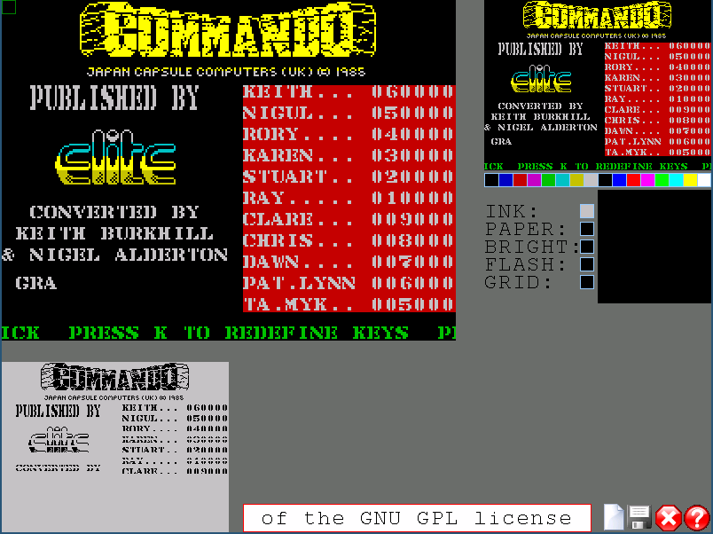

zxscredit 0.9
by Catalin Mihaila
Extracted from https://worldofspectrum.net/pub/sinclair/tools/unix/ZXscredit-0.9.tar.gz

this is a *very* simple ZX Spectrum screen editor, ported by Einar Lielmanis to SDL2 to see if/how it works,

A sample screenshot from editor:

